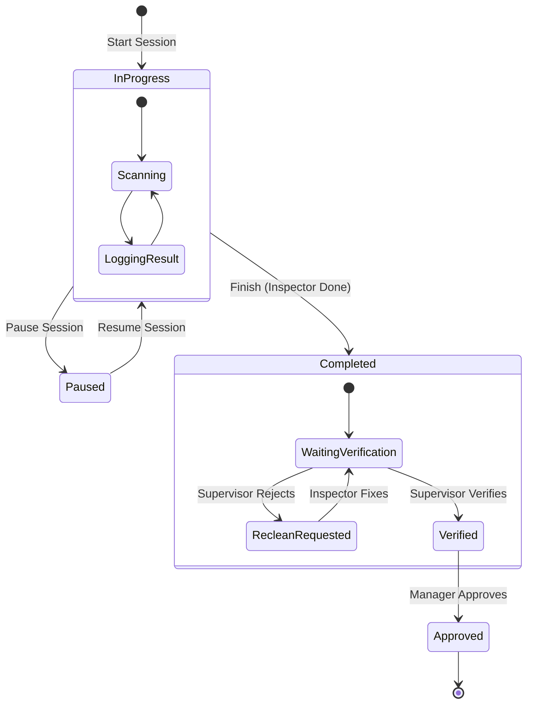

# Inspection System Workflow

This document defines the standard workflow states and transitions for the Hygiene Checklist System.

## Core Concepts

The system revolves around **Inspection Sessions**. A session represents a specific round of checks performed by an Inspector for a Department/Area during a specific Shift on a specific Date.

### State Machine

The `InspectionSession` model follows this strict state machine:

### State Definitions

| State | Description | Who Can Act | Allowed Actions |
| :--- | :--- | :--- | :--- |
| **In Progress** | Inspection is active. Logs are being created. | Inspector | Add Logs, Pause, Finish |
| **Paused** | Temporarily stopped (e.g. break). | Inspector | Resume |
| **Completed** | Inspection finished. No new items can be added. | Inspector | View only (unless fixing Re-clean) |
| **Verified** | Supervisor has checked and signed off. | Supervisor | Verify, Reject (Request Re-clean) |
| **Approved** | Manager has reviewed and approved. Session is **LOCKED**. | Manager | Approve |

### Data Integrity Rules

1.  **session_locked (is_locked):** Once a session is **Approved**, the `is_locked` flag must be set to `true`. No modifications of any kind (including re-cleans) are allowed.
2.  **Scope Isolation:** Inspectors can only see/start sessions for their assigned Department (unless Global Admin).
3.  **Unique Session:** Only one *Active* session (In Progress/Paused) is allowed per Inspector/Shift/Department/Type.

## Corrective Action Workflow

When a Checkpoint Fails:

1.  **Immediate Correction (Reclean):**
    *   Inspector marks "Fail".
    *   System prompts for "Correction Action" & "Photo".
    *   Inspector fixes it immediately or later in the same session.
    *   *Note: If fixed immediately, it might be logged as Pass with Note, but currently system logs Fail first.*

2.  **Supervisor Re-clean Request:**
    *   Session is `Completed`.
    *   Supervisor checks logs. Finds a "Pass" they disagree with, or a "Fail" that needs fixing.
    *   Supervisor changes Log Status to `reclean`.
    *   Session Status effectively reverts to allow editing specifically for that item.

3.  **Corrective Action Request (CAR):**
    *   Issue cannot be fixed immediately (e.g., broken tile).
    *   Inspector/Supervisor clicks "Escalate".
    *   A new record in `corrective_actions` is created.
    *   Status tracks independent of the Inspection Session.
